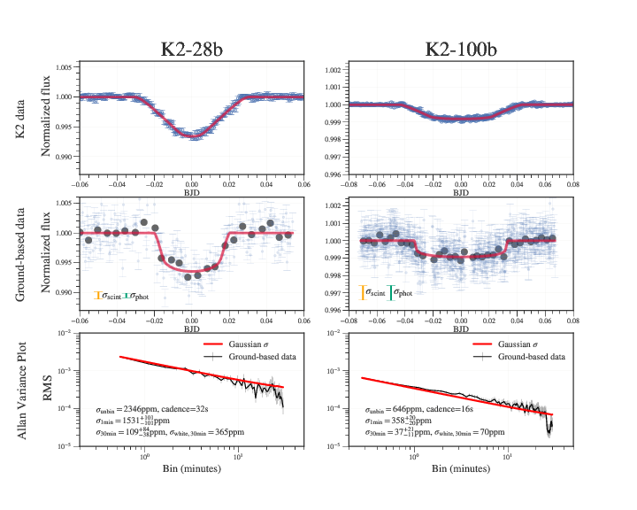
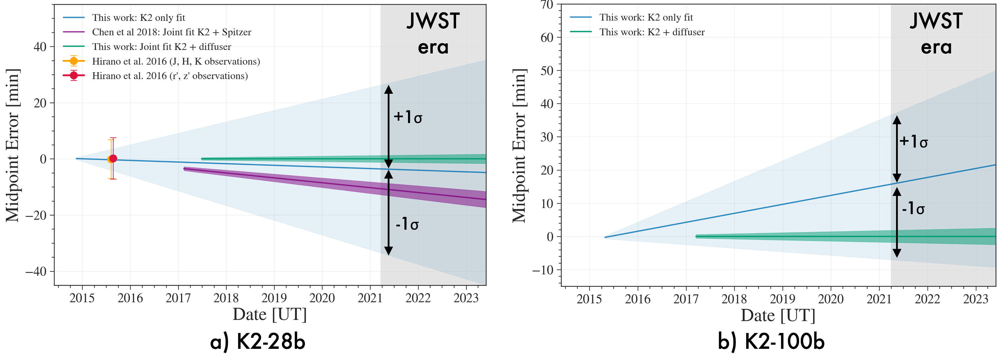
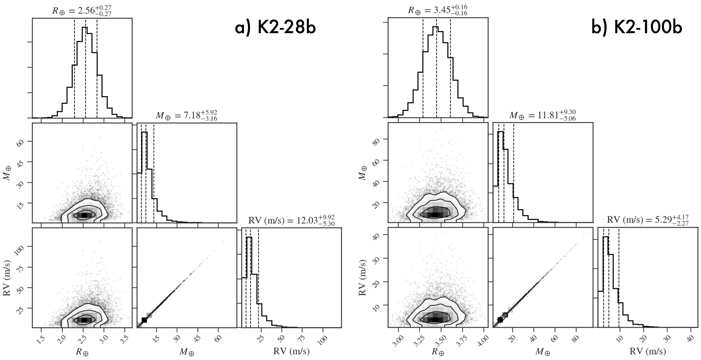

# Diffuser-Assisted-K2-Followup of K2-28b and K2-100b

.. image:: https://img.shields.io/badge/GitHub-gummiks%2FDiffuser-Assisted-K2-Followup-blue.svg?style=flat
    :target: https://github.com/gummiks/Diffuser-Assisted-K2-Followup
.. image:: http://img.shields.io/badge/arXiv-1807.04420-orange.svg?style=flat
    :target: http://arxiv.org/abs/1807.04420
.. image:: http://img.shields.io/badge/license-MIT-blue.svg?style=flat
    :target: https://github.com/gummiks/Diffuser-Assisted-K2-Followup/blob/master/LICENSE.rst

# Abstract and Summary
Code to generate the plots and analysis in Stefansson and Li et al. 2018 (submitted), where we present two precision transit observations of the Neptune-sized planets K2-28b and K2-100b, using the Engineered Diffuser on the ARCTIC imager on the ARC 3.5m Telescope at Apache Point Observatory. 

# Notes on this git repo

- Plots from the paper are shown below
- Analysis notebooks can be found in the `notebooks/` directory.
- All data used and analyzed in the paper is found in the `data/` directory.

# Plots from the paper

## Figure 1: Transits of K2-28b and K2-100b
Transits of a) K2-28b and b) K2-100b. 

- Top panels: Best-fit phase-folded transits of the K2 data analyzed in this work. 
- Middle panels: Diffuser-assisted ground-based transits as observed with the diffuser on the ARC 3.5m Telescope at APO. The unbinned data are shown in blue with a cadence of 32s and 16s for K2-28b and K2-100b, respectively. The gray points are 5 minute bin points. Additionally shown are the mean errorbars from photon, dark, and read noise (green errorbar) and the errorbar due to scintillation (orange errorbar). The gaps in the K2-100b were due to clouds. 
- Bottom panels: Photometric precision as a function of bin size in minutes.

## Figure 2: Ephemeris update of K2-28b and K2-100b
Updated ephemerides for a) K2-28b and b) K2-100b. The shaded blue regions show the ephemerides derived from the K2-only fits in this work, and the green-shaded regions show the ephemerides derived from our joint K2 and ground-based fits. A nominal beginning of the JWST-era is shown in the gray-shaded area, assuming a launch date of March 30th, 2021. Additionally shown for K2-28b (left panel) are midpoints derived from Hirano et al. 2016 (orange and red points), along with a comparison to the Chen et al. 2018 K2+Spitzer ephemeris. Our joint models demonstrate an order of magnitude increase in our transit timing precision from our fits using K2 data alone.

## Figure 3: The emerging picture of K2-28b´s transmission spectrum

## Figure 4: Expected masses and radial-velocity semiamplitudes of K2-28b and K2-100b
Predicted masses and radial velocity semi-amplitudes for a) K2-28b, b) K2-100b. Masses are predicted from the best-fit radii using Forecaster package (Chen et al. 2017), and the expected RV semi-amplitude is calculated using Equation 5 in the paper, using the predicted mass and the best-fit parameters obtained from the joint-fit models in this work as inputs.

# Dependencies
- exotk: https://github.com/hpparvi/PyExoTK
- pyde: https://github.com/hpparvi/PyDE
- Everest 2.0: https://github.com/rodluger/everest
- bls: https://github.com/dfm/python-bls
- forecaster: https://github.com/chenjj2/forecaster 
- george: https://github.com/dfm/george
- batman: https://github.com/lkreidberg/batman
- emcee: http://dfm.io/emcee/current/
- corner: https://corner.readthedocs.io/en/latest/
- astropy: http://www.astropy.org/
- astroplan: http://astroplan.readthedocs.io/en/latest/
